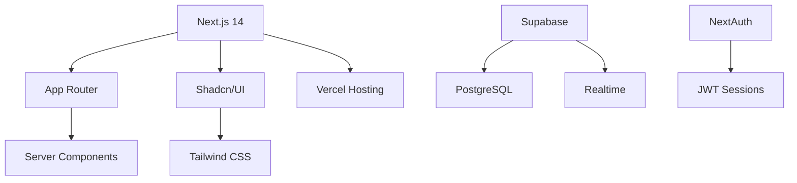

<p align="center">
  
</p>

# SellSmart-Pro: Amazon Seller Analytics Platform

*Your All-In-One Amazon Growth Partner*

[](https://nextjs.org/)
[](https://www.typescriptlang.org/)
[](https://tailwindcss.com/)

<p align="center">
  
  
</p>

## 🚀 Project Overview

SellSmart-Pro is an innovative Amazon Seller Analytics Platform designed to empower sellers with real-time insights into their sales performance. With a focus on user-centric design and cutting-edge technology, SellSmart-Pro provides a comprehensive suite of features to help sellers make informed decisions and optimize their marketing strategies.

## 🎯 Key Features

- **Real-time Analytics**: Monitor sales trends, inventory levels, and order performance in real-time
- **AI-Powered Insights**: Utilize advanced machine learning algorithms for personalized recommendations
- **Cross-account Data Aggregation**: Access data from multiple Amazon accounts seamlessly
- **Role-based Access Control**: Define user roles and permissions to control access to different features

## 🛠 Tech Stack

- **Frontend**: Next.js 14, App Router, Server Components, Shadcn/UI, Tailwind CSS
- **Backend**: Supabase, PostgreSQL, Realtime
- **Authentication**: NextAuth, JWT Sessions
- **Deployment**: Vercel Hosting

## 🏗 Architecture

<details>
<summary>Modern Tech Stack Overview</summary>


</details>

## 📦 Quick Start

```bash
git clone https://github.com/johnwesleyquintero/SellSmart-Pro.git
cd SellSmart-Pro
pnpm install
cp .env.example .env.local
pnpm dev
```

## 👥 Development Guide

### Environment Setup

```bash
export SUPABASE_URL="your-url"
export SUPABASE_KEY="your-key"
export NEXTAUTH_SECRET="your-secret"
```

### Branch Convention

```bash
git checkout -b feat/<feature-name>
git checkout -b fix/<bug-description>
```

## 📚 Documentation

| Section | Description |
|---------|-------------|
| [API Reference](docs/api-reference.md) | Swagger-powered endpoints |
| [Data Models](docs/data-models.md) | Database schema diagrams |
| [Auth Flow](docs/auth-flow.md) | Authentication sequence diagram |

## 🔐 Security

- JWT Session Encryption
- Row-Level Security Policies
- CSP Headers Configuration
- Rate Limiting (Up to 1000 RPM)

## 🤝 Contributing

We welcome contributions! Please see our [Contributing Guide](CONTRIBUTING.md) for details.

## 📄 License

This project is licensed under the terms of the [MIT license](LICENSE).
