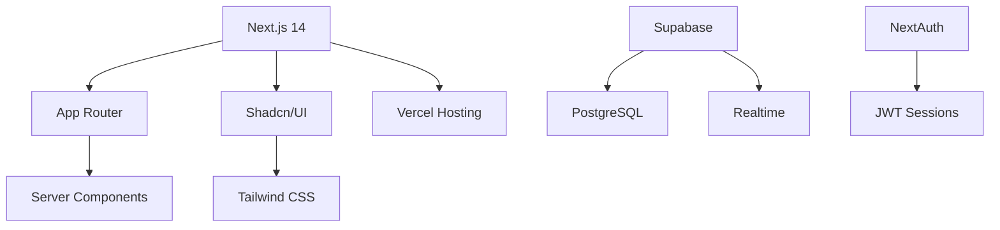

# Nebula-Singularity: Amazon Seller Analytics Platform



## 🚀 Features
- Real-time Amazon Seller Analytics
- AI-Powered Market Insights
- Cross-account Data Aggregation
- Role-based Access Control

## 🏗 Architecture
<details>
<summary>Modern Tech Stack Overview</summary>


</details>

## 🛠 Quick Start
```bash
git clone https://github.com/your-org/nebula-singularity.git
cd nebula-singularity
pnpm install
cp .env.example .env.local
pnpm dev
```

## 👥 Role-Based Guides
<details>
<summary>🔧 Developer Setup</summary>

### Environment Configuration
```bash
export SUPABASE_URL="your-url"
export SUPABASE_KEY="your-key"
export NEXTAUTH_SECRET="your-secret"
```
</details>

<details>
<summary>📈 Contributor Workflow</summary>

### Branch Convention
```bash
git checkout -b feat/<feature-name>
git checkout -b fix/<bug-description>
```
</details>

## 📚 Documentation
| Section | Description |
|---------|-------------|
| [API Reference](#) | Swagger-powered endpoints |
| [Data Models](#) | Database schema diagrams |
| [Auth Flow](#) | Authentication sequence diagram |

## 🔐 Security
<details>
<summary>Implementation Details</summary>

- JWT Session Encryption
- Row-Level Security Policies
- CSP Headers Configuration
- Rate Limiting (Up to 1000 RPM)
</details>
