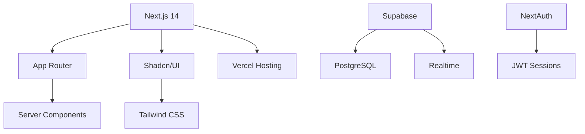

<div align="center">
  
  <h1 style="background: linear-gradient(135deg, #059669 0%, #06b6d4 100%); -webkit-background-clip: text; -webkit-text-fill-color: transparent; margin: 20px 0; font-family: 'Inter', sans-serif; font-weight: 800;">SellSmart-Pro: Amazon Seller Analytics Platform</h1>
  
  ***Your All-In-One Amazon Growth Partner.***

  <!-- Tech Stack Badges -->
  <div style="display: flex; flex-wrap: wrap; gap: 12px; justify-content: center; margin: 2rem 0 3rem; padding: 1rem; background: rgba(5, 150, 105, 0.05); border-radius: 12px;">
  <a href="https://nextjs.org/" style="display: inline-flex; align-items: center; padding: 8px 16px; background: #fff; border-radius: 8px; border: 1px solid #e5e7eb; transition: all 0.2s ease;">
    
  </a>
  <a href="https://www.typescriptlang.org/" style="display: inline-flex; align-items: center; padding: 8px 16px; background: #fff; border-radius: 8px; border: 1px solid #e5e7eb; transition: all 0.2s ease;">
    
  </a>
  <a href="https://tailwindcss.com/" style="display: inline-flex; align-items: center; padding: 8px 16px; background: #fff; border-radius: 8px; border: 1px solid #e5e7eb; transition: all 0.2s ease;">
    
  </a>
</div>

<div style="display: grid; grid-template-columns: repeat(auto-fit, minmax(300px, 1fr)); gap: 2rem; margin: 3rem 0;">
  
  
</div>
  <div style="height: 4px; background: linear-gradient(90deg, #059669 0%, #06b6d4 100%); margin: 2rem auto; width: 80%; border-radius: 2px;"></div>
</div>

<div style="background: linear-gradient(135deg, rgba(5, 150, 105, 0.05) 0%, rgba(6, 182, 212, 0.05) 100%); padding: 2rem; border-radius: 16px; margin: 3rem 0; border: 1px solid rgba(5, 150, 105, 0.1); box-shadow: 0 1px 3px rgba(5, 150, 105, 0.04);">
<h2 style="color: #059669; margin-bottom: 1rem;">Project Overview</h2>

SellSmart-Pro is an innovative Amazon Seller Analytics Platform designed to empower sellers with real-time insights into their sales performance. With a focus on user-centric design and cutting-edge technology, SellSmart-Pro provides a comprehensive suite of features to help sellers make informed decisions and optimize their marketing strategies.

## 🎯 Key Features
- **Real-time Analytics**: Monitor sales trends, inventory levels, and order performance in real-time.
- **AI-Powered Insights**: Utilize advanced machine learning algorithms to provide personalized recommendations for product placement, promotions, and inventory management.
- **Cross-account Data Aggregation**: Access data from multiple Amazon accounts seamlessly.
- **Role-based Access Control**: Define user roles and permissions to control access to different features.

## 🛠 Tech Stack
- **Frontend**: Next.js 14, App Router, Server Components, Shadcn/UI, Tailwind CSS
- **Backend**: Supabase, PostgreSQL, Realtime
- **Authentication**: NextAuth, JWT Sessions
- **Deployment**: Vercel Hosting

## 🏗 Architecture
<details>
<summary>Modern Tech Stack Overview</summary>


</details>

## 🛠 Quick Start
```bash
git clone https://github.com/your-org/SellSmart-Pro.git
cd SellSmart-Pro
pnpm install
cp .env.example .env.local
pnpm dev
```

## 👥 Role-Based Guides
<details>
<summary>🔧 Developer Setup</summary>

### Environment Configuration
```bash
export SUPABASE_URL="your-url"
export SUPABASE_KEY="your-key"
export NEXTAUTH_SECRET="your-secret"
```
</details>

<details>
<summary>📈 Contributor Workflow</summary>

### Branch Convention
```bash
git checkout -b feat/<feature-name>
git checkout -b fix/<bug-description>
```
</details>

## 📚 Documentation
| Section | Description |
|---------|-------------|
| [API Reference](#) | Swagger-powered endpoints |
| [Data Models](#) | Database schema diagrams |
| [Auth Flow](#) | Authentication sequence diagram |

## 🔐 Security
<details>
<summary>Implementation Details</summary>

- JWT Session Encryption
- Row-Level Security Policies
- CSP Headers Configuration
- Rate Limiting (Up to 1000 RPM)
</details>
